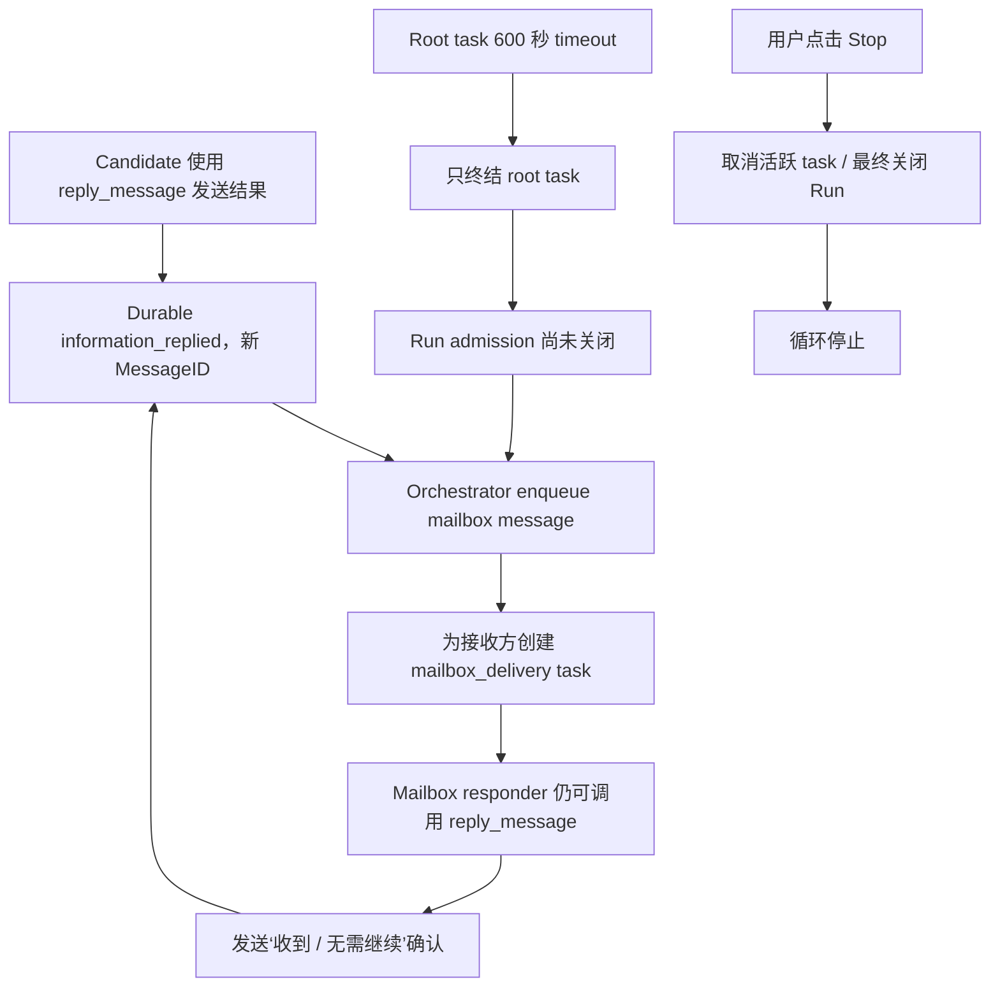
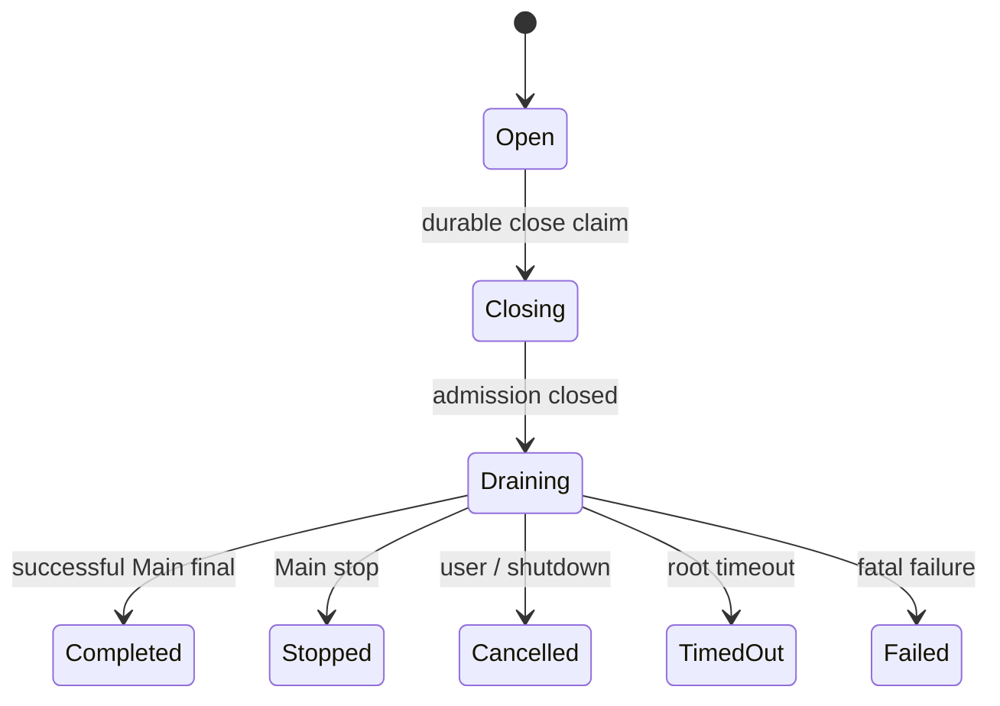

# Cowork Run 终态控制缺口与 Mailbox 活锁事故报告

> 日期：2026-08-07
> 事故 Session：`cowork_anv6q9f3`
> 状态：已完成只读事故分析与修复设计；尚未修改业务源码、配置或测试源码
> 范围：Councis 当前 Cowork 运行时；相关底层路径与 Intatis 当前修复版相同

## MODEL_CHECK_RESULT

- 当前环境可确认是 Codex / GPT-5 系列 Agent。
- 环境没有提供可审计的精确 deployment 名称，因此不编造更细型号。

## PATH_CHECK_RESULT

- `pwd`：`/Users/vita/Vitemis/Councis`
- Git root：`/Users/vita/Vitemis/Councis`
- 两者一致，符合项目要求。

## FILES_WRITTEN

- 仅新增本报告：
  `codex-report/08_07_26-21_56-cowork-run-terminal-control-and-mailbox-livelock-report.md`
- 未修改 `Apps/`、`Packages/`、`docs/`、配置、测试源码或 session 持久化数据。

## 0. 结论先行

`cowork_anv6q9f3` 发生的不是 UI 假象，而是真实的 mailbox 活锁：`@main` 与
`@cand_glm` 将“收到、无需继续”的确认文本通过 `reply_message` 互相发送；每一条回复都会获得
新的 MessageID，并无条件触发新的 mailbox delivery invocation。由于新 MessageID 不属于同一
delivery 的 retry lineage，既有“同一 MessageID / 同一 TaskID 最多三次尝试”的修复无法阻止这条
新消息链。

本事故暴露两个需要同时修复、但层级不同的缺口：

1. **Run 生命周期缺口**：当前没有 Main 可调用的 `finish_run` / `stop_run`；更根本地说，
   没有一个被 Main 正常完成、用户 Stop、root timeout、fatal failure 共同调用的统一
   `closeRun` 控制面终态操作。Root 超时只终结了 root task，没有先关闭该 Run 的新 admission。
2. **Mailbox 协议缺口**：`reply_message` 的 `inReplyTo` 是可选的；回复本身仍被当作可再次回复的
   新消息；普通 mailbox responder 继续拥有 `reply_message`。系统提示词中的“Respond only when
   useful”不是运行时边界，无法阻止模型用一条回复来说明“无需回复”。

优先级上，统一 Run 终态是主修复，reply-to-reply 的硬性禁止是不可省略的第二道保险。只实现其中
任何一项都不能完整覆盖本事故。

## 1. 事故事实

### 1.1 日志规模与最终状态

只读检查 canonical EventLog：

- 路径：`~/Library/Application Support/Intatis/cowork_anv6q9f3/events.jsonl`
- 大小：3,539,347 bytes
- 事件数：4,264（`seq 0...4263`）
- 起始时间：2026-08-07 21:04:33 +08:00
- 最后事件时间：2026-08-07 21:22:45 +08:00
- 连续 5 秒观察期间文件大小、行数和 mtime 均未变化，说明当前循环已经停止。
- 最后 durable 状态为 `submission_status_changed(status=failed)`。

### 1.2 资源消耗

| 指标 | 已确认值 |
|---|---:|
| Agent turn / `turn_stats` | 13 |
| Mailbox delivery turn | 8 |
| 非 mailbox turn | 5 |
| 日志记录总 token | 767,542 |
| Mailbox delivery token | 351,069 |
| Mailbox 占总 token | 约 45.7% |
| Tool calls | 112 |
| `information_replied` | 8 |
| 缺少 `inReplyTo` 的 reply | 5 |
| 真正委派给 `@judge` 的 task | 0 |

这意味着在 root task 已经超时后，系统又消耗了约 35 万 token 处理确认消息；这不是轻微的 UI
重复，而是会持续产生 provider 请求、权限审查、工具调用和持久化事件的真实资源失控。

### 1.3 关键时间线

| 本地时间 | EventLog 证据 | 说明 |
|---|---|---|
| 21:04:39 | `seq 16 task_created(task_r1268rk6)` | `@main` root invocation 启动 |
| 21:07:10 | `seq 263/264` | 原 Kimi route 因不接受 `developer` role 返回 HTTP 400；这是独立兼容性问题 |
| 21:08:49 | `seq 861 information_replied(msg_9glfb5lm)` | `@cand_glm` 除正常 Task Report 外，又主动向 Main 发送候选摘要 |
| 21:08:49 | `seq 865 task_created(task_91gsw6g5)` | 第一条 exact mailbox delivery 已创建，但 Main 仍被 root single-flight 占用 |
| 21:14:39 | `seq 2150/2151` | Main turn interrupted；root task 因 600 秒 timeout 失败 |
| 21:15:40 | `seq 2296 information_replied(msg_8cx3r113)` | Main 处理第一条 mailbox 消息后，回复“已收到、无需进一步动作” |
| 21:16:44–21:22:11 | 多个 `information_replied` + 新 mailbox task | Main 与 GLM 交替确认，每次回复生成新 MessageID 与新 TaskID |
| 21:22:45 | `seq 4256 task_cancelled` | 用户取消最后一个 mailbox task |
| 21:22:45 | `seq 4262 continuation_run_cancelled` | Run 最终才进入 cancelled |
| 21:22:45 | `seq 4263 submission_status_changed(failed)` | Submission 以 root timeout 失败结束 |

### 1.4 实际循环形状



## 2. 当前停止能力审计

### 2.1 已实现的能力

| 能力 | 入口 | 调用者 |
|---|---|---|
| UI 当前活动 Stop | `Apps/IntatisMac/Sources/CoworkViewModel.swift:3117` 的 `cancelCurrentActivity()` | 用户 / GUI |
| Session shutdown | `CoworkViewModel.stop(reason:)` | App 生命周期 |
| 取消单个 invocation | `Packages/IntatisCowork/Sources/Orchestrator.swift:3656` 的 `cancel(taskID:)` | Host runtime |
| 取消全部 data-plane tasks | `Orchestrator.cancelActiveTasks(reason:)` | GUI / Host runtime |
| 按 Goal / ContinuationRun 精确取消 | `Orchestrator.cancelActiveTasks(goalID:continuationRunID:...)` | Goal control plane |
| Main 无工具最终文本终结当前 invocation | `AgentLoop` final branch | 隐式模型完成 |

现有的 scoped Goal/run cancellation 已具备重要的正确顺序：先把 cancellation scope 放入
`cancelledGoalRunScopes`，再挂起 scheduler、等待 admission lock、取消 invocation、discard pending
messages。这证明底层已有可复用的 cancellation 组件。

### 2.2 完全缺失的 Main-facing 控制能力

当前 Cowork 工具注册包含：

- `send_message` / `request_information` / `reply_message`
- `request_delegation` / `delegate_task` / `ask_agent`
- `spawn_agent` / `list_agents` / `list_inference_profiles` / `remove_agent`
- `task_create` / `task_update` / `task_get` / `task_list`
- `create_goal` / `get_goal` / `update_goal`

当前不存在：

- `finish_run`
- `stop_run`
- `close_run`
- `complete_submission`
- `finish_submission`

因此 Main 目前只能：

1. 返回无工具最终文本，隐式完成自己的 invocation；或者
2. 等待用户/宿主取消；或者
3. 被 timeout/failure 终结。

Main 无法通过结构化工具调用向控制面表达：

> “我已经获得最终候选/Judge 结论；立即封闭当前 Run，不再接受新的 task/message/mailbox
> admission，然后完成最终回答。”

隐式 invocation completion 也不等价于关闭整个 Run：当前 host 仍会等待 scheduler/mailbox idle，
而新 mailbox admission 可以在这段窗口中继续产生。

## 3. 根因定位

### 3.1 `reply_message` 永远生成新的可调度消息

文件：`Packages/IntatisCowork/Sources/Orchestrator.swift`

`replyMessage(from:to:content:inReplyTo:taskID:)` 当前执行：

1. 调用 `MessageBus.replyMessage`，先持久化 `.informationReplied`；
2. 使用新的 `payload.replyID` 构造 `PendingAgentMessage`；
3. `scheduler.enqueueMessage(message)`；
4. 无条件调用 `enqueueMailboxWakeTask(... requestedMessageIDs: [message.id])`。

代码没有判断被回复的原消息 kind，也没有禁止 reply-to-reply。`inReplyTo` 是 optional，且没有要求
它必须引用当前 invocation 实际呈现、方向匹配、尚未回复的 message。

### 3.2 普通 mailbox responder 继续获得回复能力

`prepareMailboxDeliveryTask` 会把 ordinary mailbox capability 收窄为 read-only/reply-only，这比旧的
完整 coordinator lease 安全得多；但它仍固定把 `.replyMessage` 放入 allowed tools。对于输入本身已经
是 `information_replied` 或 completion report 的 delivery，这个能力没有正当用途，反而允许模型
用回复表达“无需回复”。

### 3.3 Prompt/Skill 不能成为循环保险

Mailbox objective 已明确：

> They are communication facts, not a new user request. Respond only when useful...

ContextBuilder 也会把 exact MessageID、kind、causal task、sender 和最多 800 字正文投影到
`Relevant direct messages`。EventLog 中正文完整存在，没有证据表明消息内容在持久化层丢失。

但模型仍多次声称“只能看到 MessageID”，并调用 `reply_message` 报告“无需进一步动作”。这说明：

- prompt 可以引导正常行为；
- prompt 不能证明模型一定不回复；
- “不要回复”必须由 tool availability、correlation validation 和 message state machine 强制执行。

### 3.4 同 MessageID bounded retry 无法覆盖新 MessageID 链

上一轮 mailbox 修复正确保证：

- delivery contract 冻结 exact MessageID；
- 失败只 retry 同一个 TaskID；
- attempts 耗尽后不为同一 pending MessageID 创建 replacement task。

本事故没有违反这些合同。每个确认都是成功持久化的新 `information_replied`，拥有全新 MessageID，
因此被正确视为新工作。缺失的是“reply lineage 必须终结/有界”的另一条协议不变量。

### 3.5 Root timeout 没有立即封闭 Run admission

Main root 在 21:14:39 已被标记 timeout/failed，但 `continuation_run_cancelled` 直到 21:22:45 才落盘。
在此期间，reply tool 和 mailbox wake path 继续允许同一 ContinuationRun 产生新工作。

现有 `communicationCancellationFailure` 与 `enqueueMailboxWakeTask` 会检查 Goal/run cancellation
tombstone，但 root timeout 路径没有在 drain 前建立该 tombstone。结果形成生命周期死锁：

```text
Host 等待 Run 工作排空
→ mailbox task 完成前发送一条新回复
→ 新回复产生新 mailbox task
→ Run 永远不能自然排空
```

## 4. 正确的统一 Run 终态设计

### 4.1 一个底层原语，多个触发入口

底层不应实现互相独立、行为漂移的 finish/stop 逻辑。应新增一个控制面原语，例如：

```text
closeRun(scope, requestedOutcome, source, reason)
```

所有入口都调用它：

| 触发入口 | requestedOutcome | source |
|---|---|---|
| Main 调用 `finish_run` | completed | mainAgent |
| Main 返回无工具最终文本 | completed | implicitMainFinal |
| Main 调用 `stop_run` | stopped / failed | mainAgent |
| 用户点击 Stop | cancelled | user |
| Root timeout | timedOut | runtime |
| Fatal provider/runtime failure | failed | runtime |
| App shutdown | cancelled / interrupted | hostLifecycle |

### 4.2 建议状态机



关键顺序必须是：

1. 取得 exact `{SessionID, SubmissionID, ContinuationRunID, root TaskID}`；
2. 在 admission lock / durable terminal-claim 边界内 first-write-wins；
3. **先把 Run 标成 Closing 并关闭新 admission**；
4. 后续 `send_message`、`request_information`、`reply_message`、delegate、spawn 和 mailbox wake
   对相同 Run 全部 fail closed；
5. cancel/drain 已有 queued、claimed、running invocation 和 pending mailbox；
6. 成功路径原子提交 final message/model-history/task/run/submission terminal；
7. timeout/cancel/failure 保留 typed source，不伪造成功答案；
8. duplicate exact close request 幂等，冲突 outcome first-terminal-wins / fail closed。

### 4.3 Main-facing 工具层

模型侧可以暴露两个清晰工具，但它们必须映射到同一个 `closeRun`：

#### `finish_run`

用途：Main 已获得足够候选、Judge 或验证结果，决定正常结束。

- 只暴露给当前 root invocation 的 `@main`；
- 只关闭当前 ToolContext 已绑定的 Run，不接受模型提供任意 SessionID/RunID/TaskID；
- 调用成功后立即封闭下游 admission；
- 当前 Main turn 可以继续输出且仅输出最终用户答案；
- 若调用后 Main 未能产生最终答案，host 仍按 timeout/failure 结束，不能伪造 completed。

#### `stop_run`

用途：Main 根据当前证据判断 Run 无法可靠完成，主动停止并报告原因。

- 同样只允许当前 root `@main`；
- 控制面关闭 admission 并取消/排空其他工作；
- 结果是 typed stopped/failed，不是 completed；
- 不允许 worker、Judge、permission reviewer 或普通 mailbox responder 调用。

### 4.4 Prompt 与 Skill 的职责

系统提示词与 Cowork Skill 应明确：

- 当 Main 已获得足够候选和 Judge 结论、准备返回最终答案时，调用一次 `finish_run`；
- 当证据表明无法完成且继续编排没有价值时，调用 `stop_run` 并给出简短原因；
- 不为普通 subtask、worker completion 或 mailbox acknowledgement 调用 Run 终态工具；
- 工具调用不是权限来源，只有 ToolRegistry + exact capability + host-bound scope 才能授权；
- 如果没有显示该工具，不能臆造调用。

Prompt/Skill 负责帮助模型做语义判断，控制面负责保证即使模型忘记调用、重复调用或错误调用，系统
仍然有界、安全且可恢复。

## 5. Mailbox 协议的独立修复

统一 `closeRun` 能在终态时切断新 admission，但正常 Run 尚未结束时仍可能形成 reply loop。因此还需
同时建立以下硬约束。

### 5.1 Reply correlation 必须真实存在

- `reply_message.inReplyTo` 改为 required；
- 必须引用当前 invocation 实际呈现的 exact MessageID；
- 原消息必须由目标 Agent 发给当前 Agent；
- 原消息必须与当前 Submission/Run scope 一致；
- 原消息必须允许回复且尚无 terminal reply；
- 任一验证失败返回 typed no-effect，不写新 mailbox message。

### 5.2 `information_replied` 是终结型消息

- `request_information` 最多得到一个相关 `information_replied`；
- `information_replied` 不允许再次通过 `reply_message` 回复；
- 处理 reply/task-report 的 mailbox delivery 不暴露 `.replyMessage`；
- 若接收方只需确认已读，成功完成 mailbox task 并 durable consume 即可，不产生对外消息。

### 5.3 最终保险

- 为消息 lineage 保存/推导 root MessageID 和 reply depth；
- reply depth 上限为 1，或由明确协议类型决定；
- 检测同一 agent pair 的 A→B→A acknowledgement cycle；
- Run 进入 Closing 后，所有 late message 走 durable discard，不创建 wake task；
- 这些限制不能依赖对内容文本做“收到”“ACK”关键词匹配。

## 6. 与 Judge / Councis 产品边界的关系

本事故中没有任何 task 真正委派给 `@judge`，因此循环不是 Judge 模型或 Judge prompt 导致的。

相关文件核对结果：

- `MessageBus.swift`：Councis 与 Intatis 当前修复版逐字节一致；
- `CommunicationDelegationTools.swift`：逐字节一致；
- `AgentScheduler.swift`：逐字节一致；
- `Orchestrator.swift` 的 Councis 差异仅为既有固定 `@judge` bootstrap、保留身份与选择限制；
  mailbox/reply/Run cancellation 底层路径与 Intatis 相同。

所以该问题属于 Intatis Cowork 基线的运行时生命周期缺口，不是 Councis 的有限 Judge 修饰引入。
后续修复应保持可逐文件同构迁移，不在 Councis 另造一套工作流。

## 7. 建议修改范围

以下是实施阶段需要进一步核对并可能修改的最小范围；本报告没有执行这些修改。

### 7.1 Production

| 文件/区域 | 预期职责 |
|---|---|
| `Packages/IntatisCowork/Sources/Orchestrator.swift` | 统一 Run close claim、admission tombstone、finish/stop/timeout/cancel 接线、reply correlation 与 mailbox tool 收窄 |
| `Packages/IntatisCowork/Sources/CommunicationDelegationTools.swift` | `reply_message.inReplyTo` schema 与 typed validation；必要时新增 Run control tool facade |
| `Packages/IntatisCowork/Sources/GoalRuntimeController.swift` | Goal continuation 的完成/停止路径复用统一 closeRun，不重复实现 |
| `Packages/IntatisAgentKernel/Sources/AgentLoop.swift` | Main implicit final 与 finish-run closing claim 的原子终态协调 |
| `Packages/IntatisAgentKernel/Sources/ContextBuilder.swift` | Main finish/stop 使用时机；mailbox reply 是 terminal communication fact |
| `Packages/IntatisProtocol/Sources/*` | 若现有事件无法表达 durable close claim，仅做 additive、legacy-decodable 扩展 |
| Cowork ToolRegistry 构造路径 | 只向 current root Main 暴露 finish/stop；worker/Judge/reviewer/mailbox 不可见 |
| `Packages/IntatisSkills/Resources/BundledSkills/cowork-agent-orchestration/SKILL.md` | 教 Main 使用真实已注册的终态工具，不改变其自主编排权 |

### 7.2 Tests

至少需要以下回归：

1. Root Main 能看到 `finish_run` / `stop_run`；worker、Judge、reviewer 和 mailbox responder 看不到。
2. `finish_run` 只能关闭当前 ToolContext exact Run，模型不能通过参数越权指定其他 scope。
3. `finish_run` 先关闭 admission，再 cancel/drain；并发 late reply 不产生 mailbox task。
4. Main 无工具 final 走与 `finish_run` 相同的 closing/terminal 路径。
5. Root timeout 自动调用同一 close path，不等待 mailbox 自然 idle 才建立 tombstone。
6. 用户 Stop 与现有 Goal cancellation 继续保留 typed source，并复用同一底层状态机。
7. `reply_message` 缺少、伪造、跨 Agent、跨 Run、已经回复的 `inReplyTo` 全部 fail closed。
8. `information_replied` delivery 不暴露 `reply_message`，成功 consume 后不产生反向消息。
9. 复刻本 session：GLM reply → Main acknowledgement attempt；断言没有第二条 reply、新 MessageID
   或第二个 mailbox task。
10. duplicate close 幂等；冲突 outcome 不得覆盖 first terminal。
11. crash/restart 在 Closing 状态只能 reconcile/drain，不恢复 admission 或重新调用 provider。
12. 旧 JSONL 缺少新增字段仍可解码；不改写现有 session。

## 8. 明确非方案

- 不只修改系统提示词或 Skill；提示词不是生命周期安全边界。
- 不靠识别“收到”“ACK”“无需回复”等自然语言阻止循环。
- 不简单缩短 600 秒 timeout；这只会更早触发同一缺口。
- 不删除、重写或离线修复 `cowork_anv6q9f3` 的 EventLog。
- 不放宽 Main、worker、Judge 或 mailbox responder 的 capability。
- 不让 worker/Judge 获得 Run 终态控制权。
- 不把 `finish_run` 与 `stop_run` 实现成两套独立状态机。
- 不因为模型调用 finish 就跳过 tool/side-effect evidence、task settlement 或 EventLog 原子性。
- 不修改现有 Cowork 的 Main 自主选择 sub-agent、模型、策略和 Judge 用法。

## 9. 建议实施顺序

1. 先冻结统一 `closeRun` 的 scope、outcome、source、first-terminal 与 durable claim 合同。
2. 把用户 Stop、root timeout、fatal failure、Goal cancellation 接到同一底层 closing 路径。
3. 新增 Main-only `finish_run` / `stop_run` facade，并把 implicit Main final 接到相同路径。
4. 收紧 reply correlation；把 `information_replied` 定义为 terminal message。
5. 调整 mailbox capability preparation，reply/task-report delivery 不再暴露 reply tool。
6. 更新 Main 系统提示词与 Cowork Skill。
7. 先运行精确 lifecycle/mailbox 回归，再运行完整 SwiftPM、macOS/iOS build。
8. 用新的 fresh session 重跑同一会议纪要决策题；确认 Judge 被调用、Run 正常完成、没有确认链。
9. 只读重放 `cowork_anv6q9f3`，确认不修改历史日志、不自动恢复 provider 工作。

## VALIDATION_RESULT

本轮实际完成：

- 核对项目路径与 Git root；
- 只读检查 `cowork_anv6q9f3` 的 canonical EventLog；
- 统计事件、turn、tool、reply、token 与 Judge task；
- 连续观察日志是否仍增长；
- 核对 Main-visible Cowork tool descriptors；
- 核对 GUI Stop、Orchestrator task/all/scoped cancellation 路径；
- 核对 reply → scheduler → mailbox wake → mailbox capability 源码链路；
- 核对相关底层文件与 Intatis 当前修复版的一致性。

因为本轮只要求形成报告，未运行构建或测试。

## UNCERTAINTIES

1. Durable Closing claim 应复用哪个现有 Event，还是增加 additive
   `continuation_run_close_requested`，需要实施前结合现有 Protocol enum 与 legacy decode 再定；不能只保存在
   内存，否则 crash/restart 可能重新开放 admission。
2. `finish_run` 调用后是否允许当前 Main 再进行一次 provider turn，还是把最终答案直接包含在工具参数
   中，需要根据现有 model-history/tool-result 原子合同选择。推荐关闭下游 admission、保留当前 Main
   输出一次最终答案，避免把长答案作为控制工具参数重复持久化。
3. 普通非 Goal submission 与 durable Goal continuation 当前共享 ContinuationRun 事件，但 GUI
   cancellation 入口不同；实施时必须证明两者最终进入同一个 close primitive，而不是表面复用名称。
4. 原 Kimi route 的 `developer` role HTTP 400 是独立 provider adapter/route compatibility 问题，不应
   混入本次 Run lifecycle 修复。

## NEXT_RECOMMENDED_ACTION

在用户确认后，先把统一 `closeRun` 状态机、Main-only 工具合同和 reply terminal invariant 写成精确
测试，再修改 production。实现必须与 Intatis Cowork 底层保持同构；不应在 Councis 以 Judge 特例或
额外编排流程绕过该问题。
